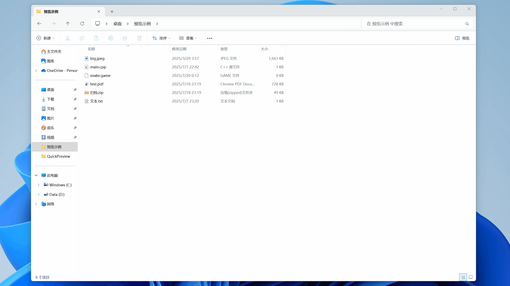

# QuickPreview

**Quick preview, more than preview.**  
为 Windows 文件资源管理器预览窗格注入更多可能性的扩展项目。

---

## 🔍 项目简介

**QuickPreview** 是一个 Windows 平台的预览窗格扩展插件。它的目标不仅是支持多种文件格式的快速预览，还希望能为预览窗格带来“更有趣、更智能、更交互”的使用体验。

快速预览，不止“预览”。

> 只需一个插件，轻松预览任意类型的文件内容，还能玩游戏、交互操作，预览窗格从此不再只是“展示而已”。

---

## ✨ 核心特性

- ✅ 全面格式支持：文本、图像、音视频、压缩包……想预览什么都可以
- ⚙️ 高度可定制化：可配置的格式规则与预览行为
- 🕹️ 创意游戏支持：在 `.game` 文件中直接体验各类经典游戏，办公室摸🐟神器

---

## 🗂️ 支持预览的格式示例

| 文件类型 | 文件后缀 | 示例 |
|-|-|-|
| `文本` | `.txt` \ `.cpp` \ `.h` |  |
| `图像` | `.jpg` \ `.jpeg` \ `.png` \ `.bmp` \ `.gif` \ `.tif` \ `.tiff` \ `.webp` \ `.ico` \ `.bmp` \ `.svg` |  |
| `音频` | `.mp3` \ `.wav` \ `.wma` \ `.aac` \ `.m4a` |  |
| `视频` | \ `.mp4` \ `.wmv` \ `.avi` \ `.mkv` |  |
| `归档` | `.zip` \ `.rar` \ `.7z` |  |
| `其他` | `.game` |  |

（更多格式正在支持中，尽请期待 🎉）

---

## 🚀 快速上手

> 暂未发布二进制安装包

